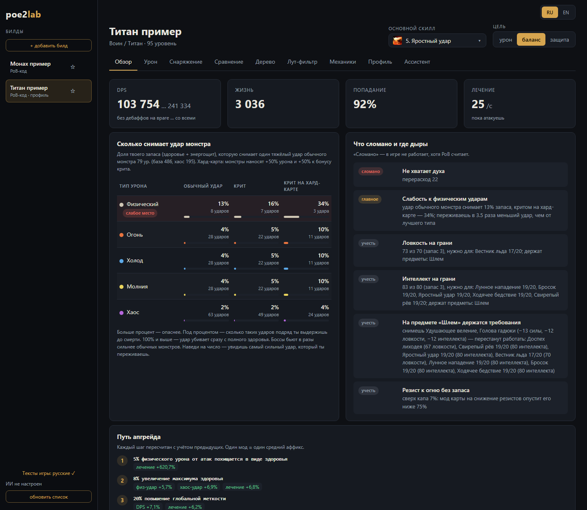

# poe2lab — Path of Exile 2 build analyzer (PoE2 · Path of Building)

**English** · [Русский](#русский)

A free, local **Path of Exile 2 (PoE2) build analysis tool** built on top of **Path of Building** (PoB-PoE2, run
headless). Paste a PoB code or a pobb.in link — or load your own character next to a guide build — and see what is
broken, what to upgrade, and what to take next on the passive tree. Every number is computed by PoB itself.

- **Build overview** — DPS and EHP, the largest monster hit you survive per damage type, resistances, what is broken
  and what to fix first.
- **Gear** — an inventory doll, item comparison, the best upgrade per slot, crafting (an item creator with item
  level 65–82, quality, catalysts, runes), prices from poe.ninja and the trade site.
- **Passive tree** — a tree viewer with the game's art: node frames, jewels in sockets, **weapon set passives**
  (sets I and II), best growth options, respec candidates, auto-allocation, **mechanic packages** (rage, charges,
  crit, ailments, minions… priced together), a rage and charges uptime model; ascendancy advice.
- **Levelling up to a guide** — guides are for 75+: pick how to level (the ways the class's attributes allow), get a
  roadmap by act and, above all, the level to switch to the build and why (each piece it waits for with PoB's number).
- **Your character vs a guide** — load your character into a build and compare numbers, gems, gear and tree with
  the guide's ("Main / Build" views).
- **Build constructor** — start from a class and ascendancy, or from a top player on the **poe.ninja ladder**.
- **Export** — a PoB code for pobb.in and Path of Building, or a file for the game's own **build planner** (.build).
- **AI assistant** (DeepSeek, Claude, OpenAI, Gemini, OpenRouter, Ollama…) — or a ready prompt for any free chatbot.
- **MCP server** — use your own AI app (Claude Desktop, Claude Code, Cursor, LM Studio…) with poe2lab's tools: it
  opens your builds and gets every number from Path of Building (`python -m poe2lab mcp`, or one button for
  Claude Desktop).
- Loot filter, crafting journal, a glossary for new players; **English and Russian** interface.

**Quick start (Windows):** *Code → Download ZIP*, unpack to a short path (e.g. `C:\poe2lab`), double-click
**`start.bat`** — it sets up Python, Path of Building and the game's texts, then opens the interface in the browser
(the program runs in the background; stop it with **⏻ Stop poe2lab** in the interface).
The full guide ([GUIDE.md](GUIDE.md)) is in Russian; the interface speaks both languages. Screenshots:
[docs/SCREENSHOTS.md](docs/SCREENSHOTS.md).



---

## Русский

**poe2lab** — бесплатный анализатор билдов **Path of Exile 2 (PoE2, ПоЕ2)** поверх **Path of Building** (PoB-PoE2,
headless): что сломано, какие статы и моды стоят больше всего, что убивает на картах, что докрафтить в каждый слот,
какие руны вставить и сколько это стоит, куда расти по пассивному дереву. Все цифры считает сам PoB.

- **Обзор билда** — урон (DPS) и запас (EHP), какой удар монстра переживаешь, резисты, что починить первым.
- **Снаряжение** — кукла как в игре, сравнение вещей, лучший апгрейд по слотам, крафт (создание вещей 65–82 уровня,
  качество, катализаторы, руны), цены с poe.ninja и торговли.
- **Пассивное дерево** — схема с артом игры: рамки нод, самоцветы в гнёздах, ноды **наборов оружия I и II**, лучший
  вариант роста, что перераспределить, автораспределение, **механики вместе** (свирепость, заряды, криты,
  состояния, приспешники…), модель свирепости и зарядов в бою; советы по возвышению.
- **Как качаться до билда** — гайды обычно на 75+: выбери, чем качаться (варианты под атрибуты класса), получи план
  по актам и, главное, с какого уровня переходить на билд и почему (каждая часть, которую ждёт переход, — с цифрой PoB).
- **Свой персонаж против гайда** — загрузи своего персонажа в билд и сравнивай цифры, камни, шмот и дерево с гайдом
  (вкладки «Мейн / Билд»).
- **Конструктор билда** — с класса и возвышения или с билда топ-игрока **ладдера poe.ninja**.
- **Экспорт** — PoB-код для pobb.in и Path of Building, файл для **планировщика билдов** игры (.build).
- **ИИ-ассистент** (DeepSeek, Claude, OpenAI, Gemini, OpenRouter, Ollama…) — или готовый промпт для любой бесплатной
  нейросети.
- **MCP-сервер** — свой ИИ-чат (Claude Desktop, Claude Code, Cursor, LM Studio…) с инструментами poe2lab: открывает
  твои билды и берёт все цифры из Path of Building (кнопка для Claude Desktop или `python -m poe2lab mcp`).
- Лут-фильтр, журнал крафта, словарь новичка; интерфейс на русском и английском, тексты — из русского клиента игры.

**Как пользоваться, что устанавливается и зачем, описание всех вкладок — в [GUIDE.md](GUIDE.md).**
Как это выглядит — [скрины всех вкладок](docs/SCREENSHOTS.md).

## Установка в один клик (Windows)

1. Скачайте проект: на https://github.com/JavelinSx/poe2lab кнопка **Code → Download ZIP**, распакуйте в папку с
   коротким путём, например `C:\poe2lab`.
2. Дважды щёлкните **`start.bat`**.

Первый запуск занимает 1–3 минуты: если нет Python 3.12+, скрипт предложит поставить его через winget; дальше сам
создаст окружение `.venv`, поставит зависимости, скачает Path of Building (архив проверенной версии, ~200 МБ) и, если
установлена Path of Exile 2 (Steam или клиент GGG; другой путь — переменная `POE2_DIR`), распакует из неё русские
тексты и иконки. Потом откроется браузер с интерфейсом, а окно консоли закроется само: poe2lab работает в фоне без
окна. Следующие запуски — сразу в интерфейс; если poe2lab уже запущен, start.bat просто откроет его в браузере.
Остановить — кнопка **«⏻ Остановить poe2lab»** внизу слева в интерфейсе. Журнал фонового сервера —
`%APPDATA%\poe2lab\ui.log` и `ui-errors.log`. Ключ ИИ у каждого свой — вводится на вкладке «Ассистент».

Без игры всё работает, но названия будут английскими (из PoB). Интерфейс это объясняет: в «⚙ настройки» внизу
слева — «Тексты игры: русские ✓» или «английские — почему?» (и плашка сверху); по нажатию открывается плашка с причиной (игра не найдена, нет утилиты
распаковки, нет интернета для справочника GGG), полем для папки игры и кнопкой «Распаковать русские тексты».

### Для разработки

```
git clone --recurse-submodules https://github.com/JavelinSx/poe2lab.git
cd poe2lab
pip install -e .[dev]
python -m poe2lab setup
```

PoB лежит git-подмодулем в `pob2/`; без git он скачивается архивом того же коммита (`POB_COMMIT` в
`poe2lab/engine/luahost.py`, тест сверяет его с подмодулем).

## Интерфейс

```
python -m poe2lab ui
```

Откроется `http://127.0.0.1:8765` — список билдов слева, вкладки: Обзор, Урон, Скиллы, Снаряжение (со сравнением
вещей: со шмотом гайда и со своей вещью из игры), Дерево (куда расти и что перераспределить), Лут-фильтр, Профиль
(факты об игре, поправки и что PoB не считает — «+» добавляет механику в расчёт), Ассистент. Правки всех вкладок —
одна полоса «Изменения» под вкладками.

Билды: кнопка «+ добавить билд» — вставить PoB-код (в PoB: Import/Export Build → Generate → Copy) или ссылку
pobb.in; билд сохраняется в `builds/<имя>.txt`. Звёздочка поднимает билд в начало списка, крестик удаляет: файл
вместе с профилем уходит в `builds/.trash`, откуда его можно вернуть. Билды, сохранённые в самом PoB, крестик только
скрывает (их файлы не трогаются), вернуть — «показать скрытые» внизу списка. Избранное и скрытые хранятся в
`%APPDATA%\poe2lab\library.json`.

Язык интерфейса (RU/EN) — переключатель справа вверху.

Русские тексты — официальные тексты игры. Моды, базы, уники и руны берутся из справочника торговли GGG, а
описания гемов, скиллы от предметов, баффы и локации — из установленной игры (Steam или клиент GGG; другой путь —
переменная `POE2_DIR`). Для чтения файлов игры нужна утилита `bun_extract_file` из
[zao/ooz](https://github.com/zao/ooz/releases) — та же, что использует экспортёр PoB: распакуйте архив
`bun-*-x64-Release.zip` в `tools/ooz/`. Интерфейс сам распакует тексты при первом запуске и заново после патча игры
(около 15 с); вручную — `python -m poe2lab gamedata`. Без игры или утилиты эти места остаются на английском.

### ИИ-ассистент

Провайдер, модель и ключ выбираются на вкладке «Ассистент»: DeepSeek, Anthropic (через официальный SDK — нужен
`pip install anthropic`), OpenAI, Google Gemini, OpenRouter, Mistral, xAI, Groq, Ollama (локально, без ключа) или свой
OpenAI-совместимый адрес. Кнопка «Загрузить список моделей» берёт список у самого провайдера. Модель должна уметь
вызывать инструменты. Ключ хранится только на этом компьютере (`%APPDATA%\poe2lab\llm.json`); можно и переменными
окружения `DEEPSEEK_API_KEY` / `POE2LAB_LLM_API_KEY`, `POE2LAB_LLM_BASE_URL`, `POE2LAB_LLM_MODEL`.

Ассистент получает билд, профиль и механики из данных игры заранее, а все цифры считает через движок PoB.
Данные билда и вопросы уходят выбранному провайдеру.

### Свой ИИ-чат через MCP

`python -m poe2lab mcp` — MCP-сервер (Model Context Protocol) с теми же инструментами, что у ассистента, плюс
`list_builds` и `open_build`. Его запускает само ИИ-приложение и общается с ним через stdin/stdout; билды сервер
только читает. На вкладке «Ассистент» карточка «🔌 Свой ИИ-чат»: кнопка «Подключить к Claude Desktop» (дописывает
`mcpServers.poe2lab` в `claude_desktop_config.json`, прежний файл — копией `.poe2lab.bak`), настройка JSON для
других приложений и команда для Claude Code:

```
claude mcp add poe2lab --scope user -e PYTHONPATH="C:\poe2lab" -- "C:\poe2lab\.venv\Scripts\python.exe" -m poe2lab mcp
```

## Командная строка

1. В PoB-PoE2: Import/Export Build → Authorize with Path of Exile → выбрать персонажа → импорт → **Save**.
   Список сохранённых в PoB билдов: `python -m poe2lab builds`. Дальше билд указывается по имени.
   (Можно и по-старому: Generate → Copy, код сохранить в `builds/<имя>.txt`.)
2. Посмотреть группы скиллов и выбрать основной: `python -m poe2lab inspect "<имя>"`
3. Запускать анализы с `--group N` (номер группы основного скилла) или записать всё один раз в
   `builds/<имя>.profile.json` (основной скилл, свирепость, мана, поправки на механики, которых нет в PoB):

| Команда | Что делает |
|---|---|
| `report` | главное: дыры, условия, ядро урона, куда вкладываться, путь апгрейда |
| `threats` | какие удары переживаешь, как быстро лечишься |
| `slots` | вклад каждого аффикса, что докрафтить по слотам, руны с ценами |
| `compare` | точное сравнение предмета с надетым (`--item`, `--breakeven`) |
| `nodes`, `gradients` | вклад нод дерева, ценность статов |
| `dossier` | всё одним JSON (`--out`) |

Например: `python -m poe2lab report titan` (у Титана есть профиль, `--group` не нужен).

В Claude Code в этой папке можно просто спросить («разбери мой билд») — навык `.claude/skills/poe2-build`
знает команды и типичные ловушки.

Тесты: `python -m pytest -q`. План — `PLAN.md`, открытые вопросы — `QUESTIONS.md`.

---

## License · Лицензия

poe2lab's own code is under the [MIT License](LICENSE). Path of Building (the `pob2/` submodule) has its own license
([pob2/LICENSE.md](pob2/LICENSE.md)).

Код poe2lab — под лицензией [MIT](LICENSE). У Path of Building (подмодуль `pob2/`) своя лицензия.

This product isn't affiliated with or endorsed by Grinding Gear Games in any way. Path of Exile and its art belong
to Grinding Gear Games; the game data and pictures are read from the installed game or from Path of Building, and
are not covered by this project's license.
