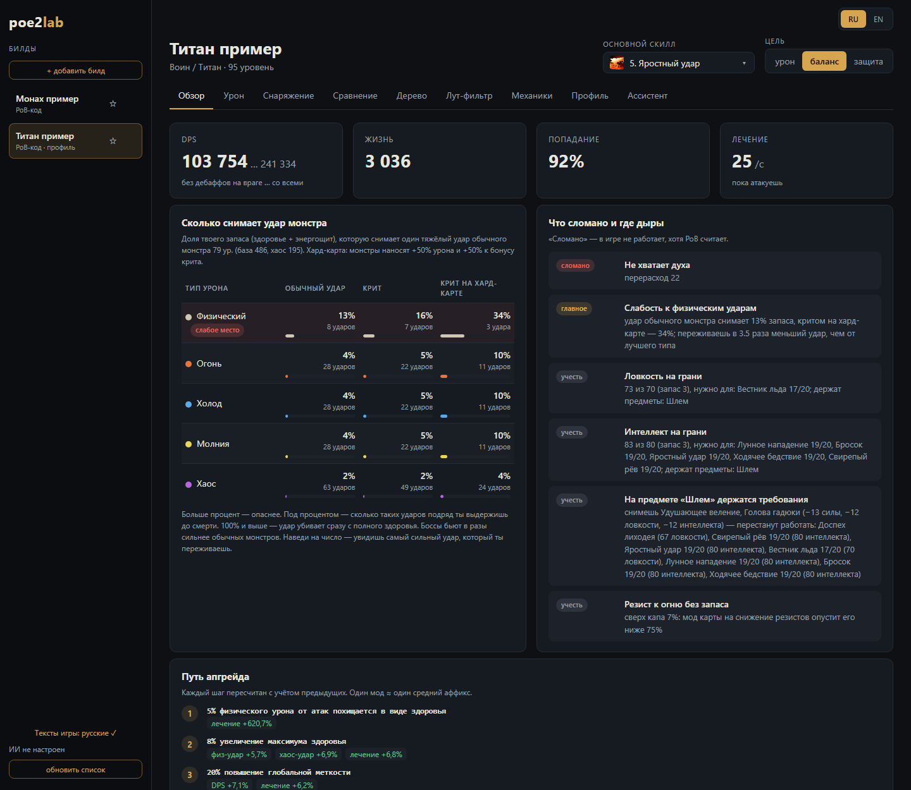
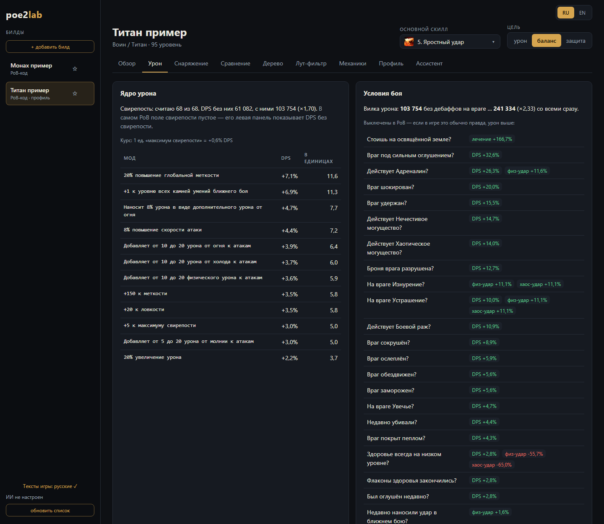
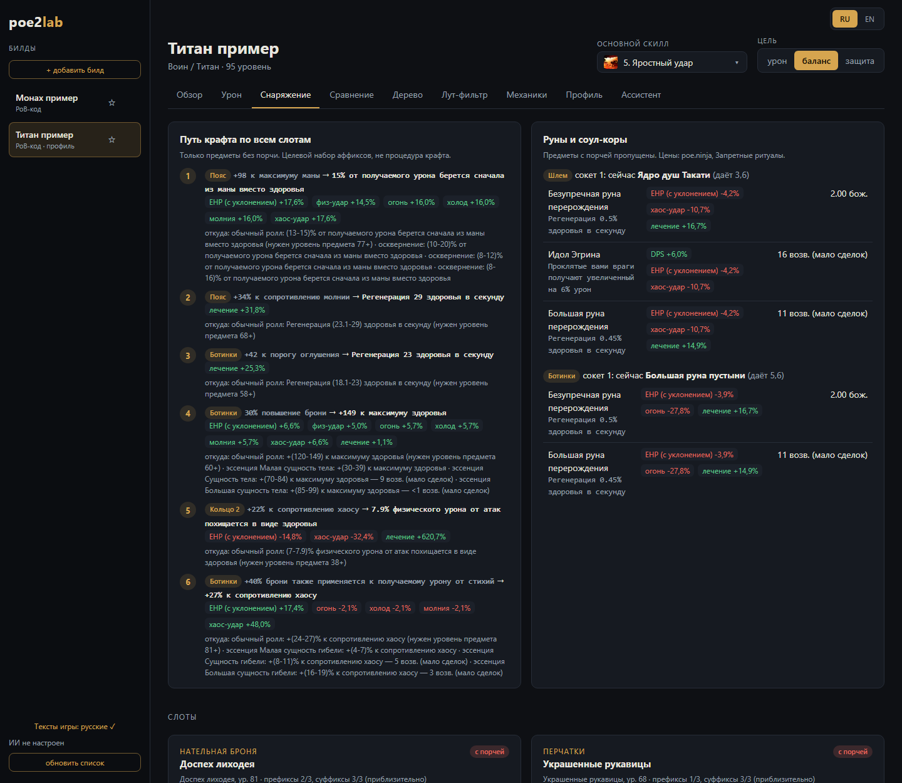
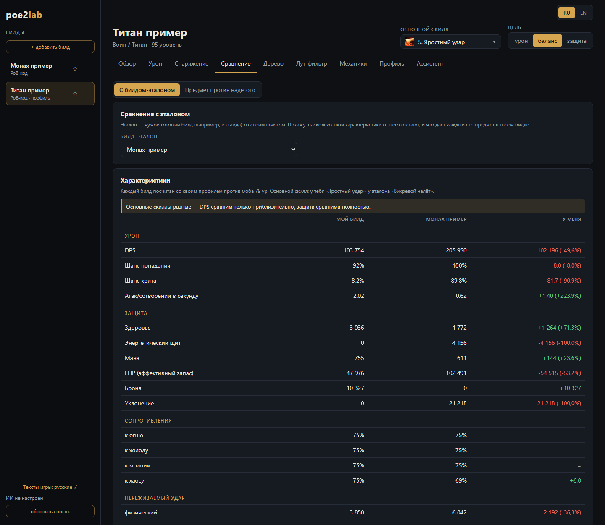
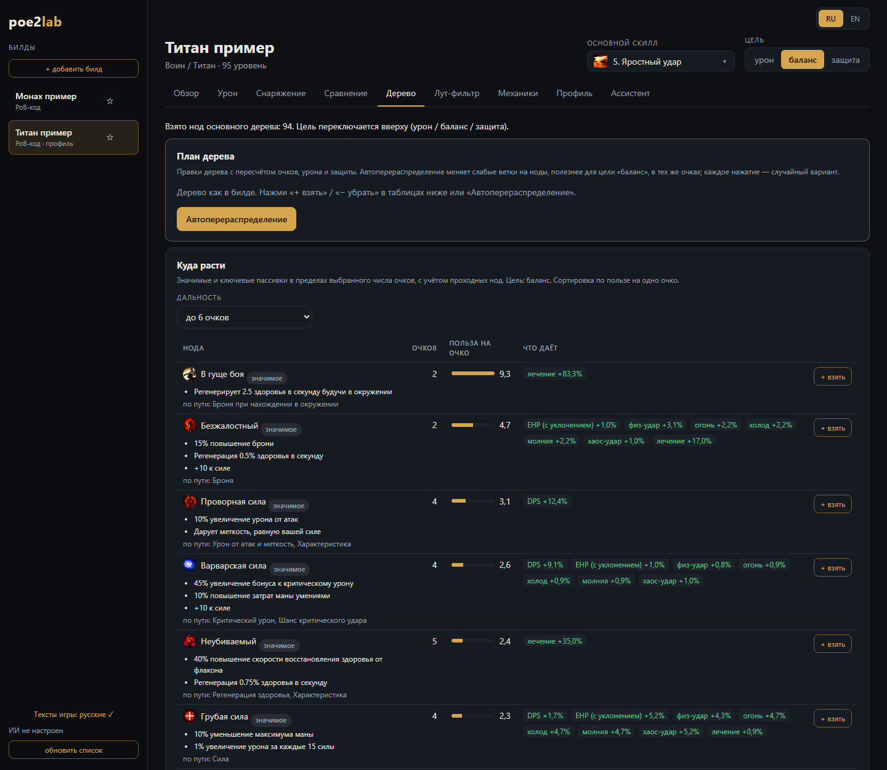
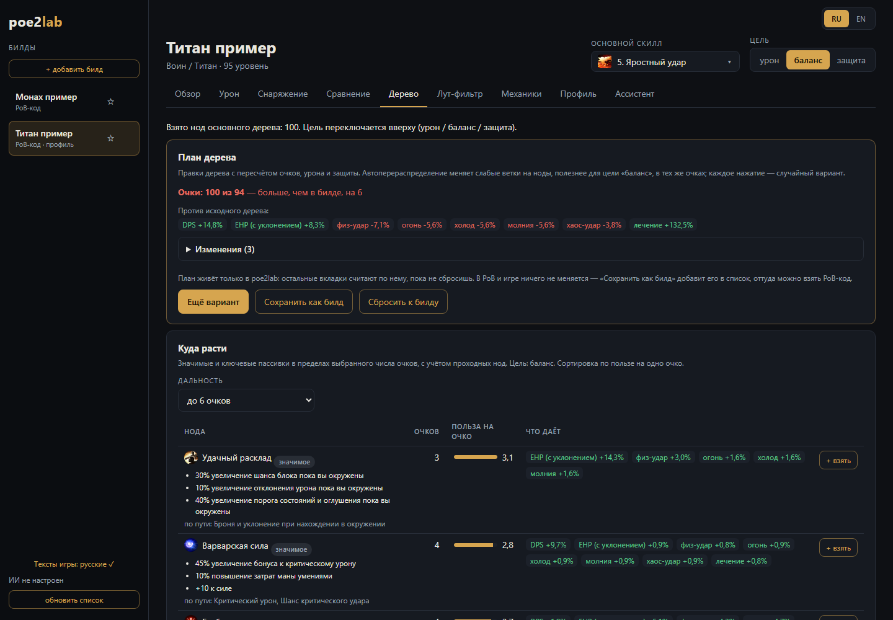
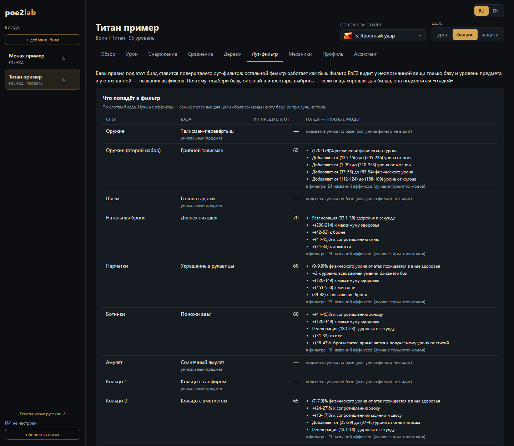
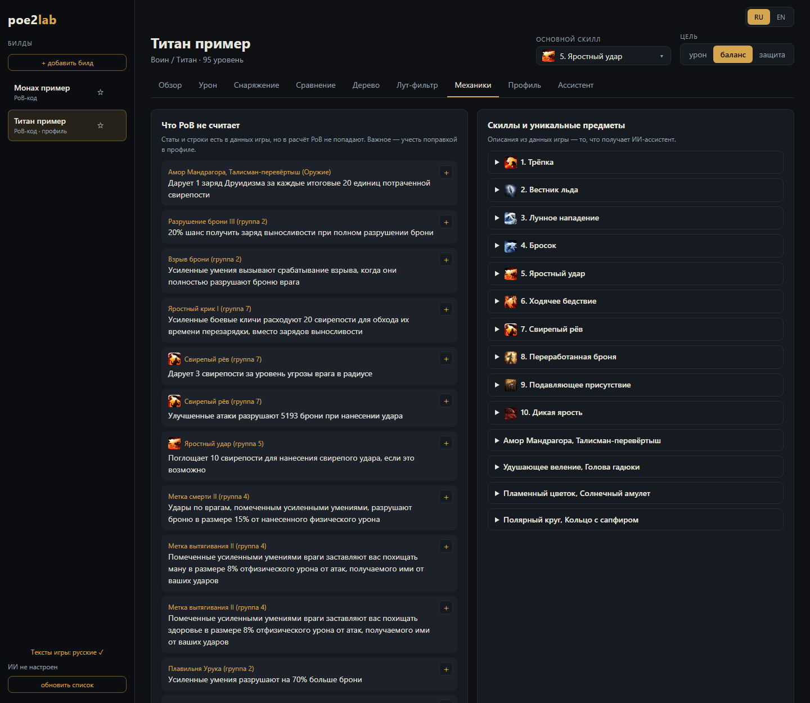
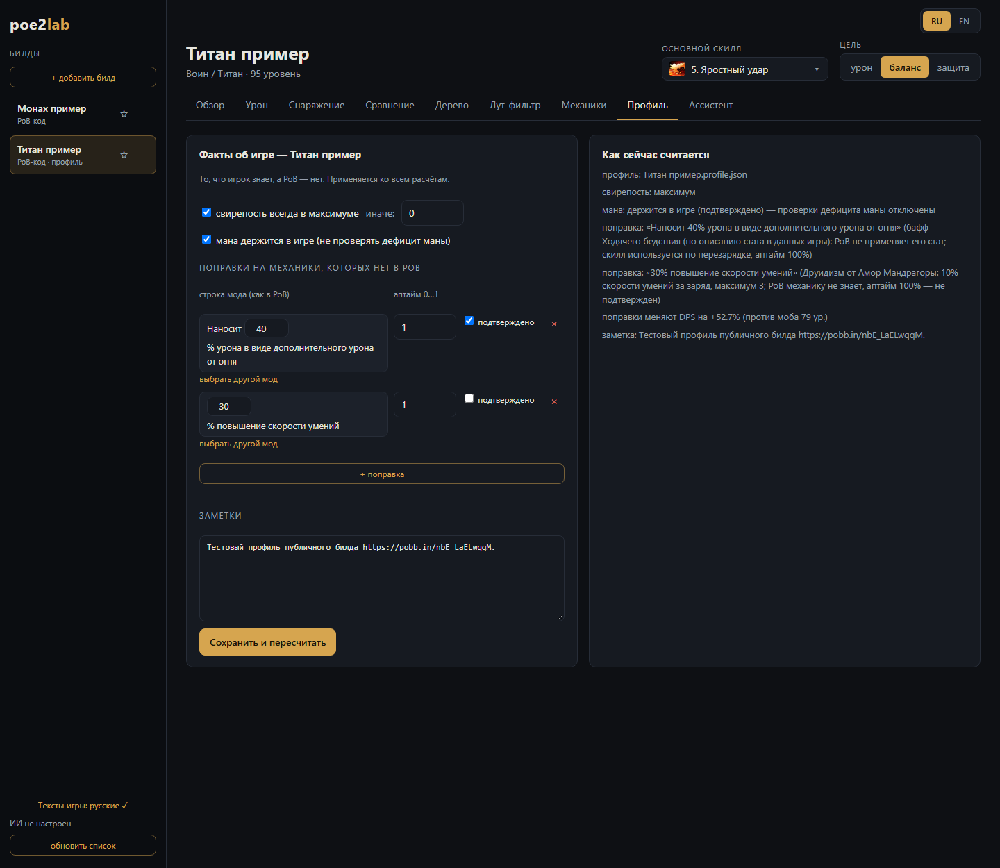
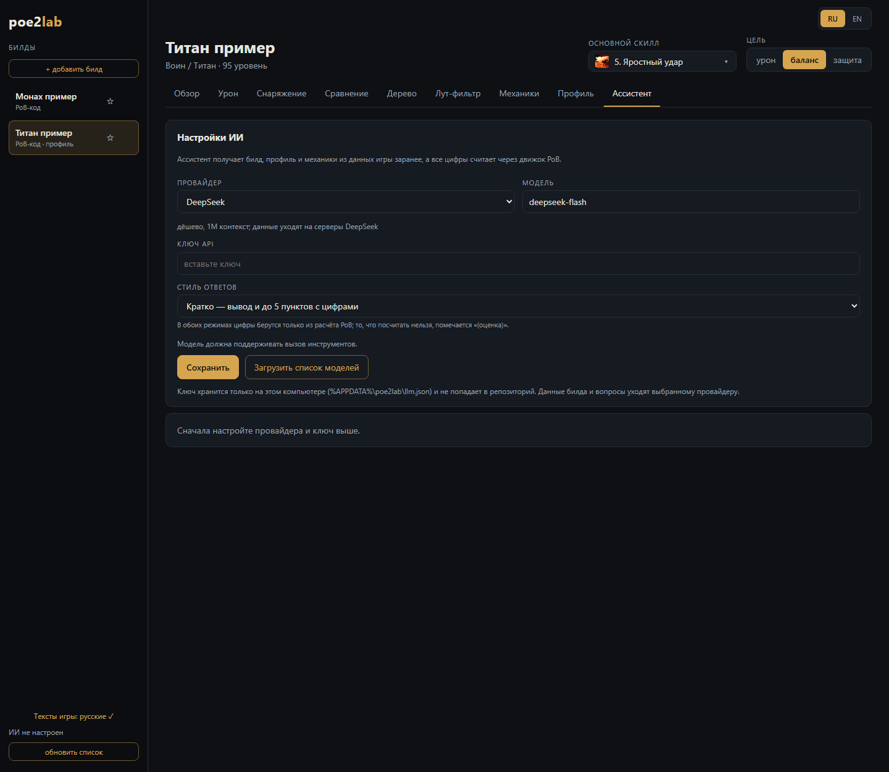

# poe2lab в картинках

Короткий тур по интерфейсу: скрин каждой вкладки и что где находится. Подробности по каждой вкладке —
в [руководстве](../GUIDE.md#4-вкладки). На скринах — публичные билды: Титан
([pobb.in/nbE_LaELwqqM](https://pobb.in/nbE_LaELwqqM)) и Монах ([pobb.in/vdObLGtT-Fx1](https://pobb.in/vdObLGtT-Fx1)).

**Общее для всех вкладок**

- **Слева** — список билдов: **«+ добавить билд»** (PoB-код или ссылка pobb.in), **☆** — в избранное.
  Под названием видно, откуда билд (PoB-код / сохранён в PoB) и есть ли у него профиль.
- **Внизу слева** — «Тексты игры: русские ✓» (если английские — нажми, там объяснение и кнопка исправить),
  статус ИИ и «обновить список».
- **Вверху справа** — язык **RU / EN**, **основной скилл** (по нему считается урон) и **цель**:
  урон / баланс / защита. Цель меняет все рекомендации на всех вкладках.
- Адрес страницы запоминает билд и вкладку: обновил страницу — остался там же.

---

## Обзор

- **Карточки сверху** — DPS (вилка «враг без дебаффов … со всеми»), жизнь, шанс попадания, лечение в секунду.
- **«Сколько снимает удар монстра»** — какая доля твоего запаса (здоровье + ЭЩ) уходит за один тяжёлый удар
  монстра 79 ур. по каждому типу урона: обычный удар, крит, крит на хард-карте. **Больше процент — опаснее.**
  Под процентом — сколько таких ударов подряд ты выдержишь. Строка «слабое место» — худший тип урона.
- **«Что сломано и где дыры»** — «сломано» (в игре не работает, хотя PoB считает), «главное», «учесть»:
  нехватка духа, характеристики на грани, предметы, которые держат требования, резисты без запаса.
- **«Путь апгрейда»** (ниже) — шаги по одному моду, каждый пересчитан с учётом предыдущих.

## Урон

- **«Ядро урона»** — механика, которую PoB не видит (здесь свирепость: DPS без неё и с ней, ×1,70), и таблица
  «курса»: сколько DPS даёт каждый мод и сколько это «в единицах» ключевого стата.
- **«Условия боя»** — флажки конфигурации PoB, которые выключены: если в игре это обычно правда (враг
  оглушён, стоишь на освящённой земле…), урон/защита будут выше на указанный процент.

## Снаряжение

- **«Путь крафта по всем слотам»** — по шагам: в каком слоте какой мод заменить на какой (`было → стало`),
  что это даёт, и **откуда** взять мод — обычный ролл (с нужным уровнем предмета) или эссенция с ценой.
  Предметы с порчей пропускаются.
- **«Руны и соул-коры»** — для каждого сокета: что стоит сейчас и что лучше вставить, с эффектом и ценой.
- **«Слоты»** (ниже) — карточка каждого надетого предмета: база, уровень, префиксы/суффиксы, пометка «с
  порчей» / «можно крафтить» и что докрафтить.

## Сравнение

- Переключатель сверху: **«С билдом-эталоном»** или **«Предмет против надетого»**.
- **Билд-эталон** — выбери из списка чужой готовый билд (например, из гайда). Таблица «Характеристики»:
  мой билд / эталон / **«У меня»** — насколько я выше (зелёный) или ниже (красный). Если основные скиллы
  разные, будет предупреждение: DPS сравним приблизительно, защита — полностью.
- Ниже (за кадром) — **«Предметы эталона в твоём билде»**: каждый его предмет примерен в мой билд по
  отдельности, с моим деревом и камнями.
- **Предмет против надетого** — вставь текст предмета из игры (Ctrl+C на предмете) и увидишь разницу по
  DPS и защите против того, что надето в этом слоте.

## Дерево

- **«План дерева»** — правки дерева без выхода из poe2lab. **«Автоперераспределение»** меняет слабые ветки
  на более полезные для выбранной цели в тех же очках; каждое нажатие — новый случайный вариант.
- **«Куда расти»** — значимые и ключевые пассивки в пределах выбранной **дальности** (сколько очков
  готов потратить). Колонки: сколько очков, **польза на очко** (полоска), что даёт в процентах, «по пути» —
  какие проходные ноды возьмутся. **«+ взять»** добавляет ноду в план.
- Ниже (за кадром) — **«Что можно перераспределить»**: взятые ветки, которые дают меньше на очко, чем лучший
  вариант роста, со счётом «освободит N очков» и кнопкой **«− убрать»**.

- **Очки** — сколько потрачено против билда (красным — если больше, чем есть: где-то нужно убрать).
- **«Против исходного дерева»** — итог плана: DPS, EHP, удары по типам урона, лечение.
- **«Изменения»** — раскрывающийся список: что убрано, что взято.
- **«Ещё вариант»** — другой случайный вариант; **«Сохранить как билд»** — план станет новым билдом в
  списке слева (оттуда можно взять PoB-код); **«Сбросить к билду»** — вернуть дерево как было.
  Пока план не сброшен, все остальные вкладки считают по нему.

## Лут-фильтр

- **«Что попадёт в фильтр»** — по каждому слоту билда: база, минимальный уровень предмета, на котором
  роллятся лучшие тиры, и **«голда — нужные моды»**: какие аффиксы подсветить у опознанной вещи.
  Для уников — подсветка по базе (имя уника фильтр не видит).
- Ниже (за кадром) — **«Собрать фильтр»**: поверх фильтра из папки игры, вставкой текста фильтра или только
  блок билда; имя нового фильтра. Блок билда ставится **поверх** твоего фильтра в новый файл, исходный не меняется.
- Как пользоваться в игре: подбери подсвеченную базу → опознай в инвентаре → выброси. Если вещь хорошая для
  билда, на земле она подсветится как «голда» — забирай.

## Механики

- **«Что PoB не считает»** — строки из данных игры, которые не попадают в расчёт PoB (с источником: предмет
  или камень и группа). **«+»** справа — добавить строку поправкой в профиль, чтобы она учитывалась.
- **«Скиллы и уникальные предметы»** — полные описания из данных игры (с иконками), раскрываются по
  щелчку. Это же видит ИИ-ассистент.

## Профиль

- **«Факты об игре»** — то, что знаешь ты, а PoB нет: свирепость всегда в максимуме, мана держится (не
  проверять дефицит).
- **«Поправки на механики, которых нет в PoB»** — мод (число правится прямо в строке), **аптайм** от 0 до 1
  и «подтверждено». «выбрать другой мод», «×» — удалить, «+ поправка» — добавить.
- **Заметки** и **«Сохранить и пересчитать»**.
- Справа **«Как сейчас считается»** — итог: что применено и насколько поправки меняют DPS.

## Ассистент

- **Провайдер** и **модель** (DeepSeek, Claude и др.), **ключ API**, **стиль ответов** (кратко / подробно).
  «Загрузить список моделей» подтянет модели провайдера.
- Ключ хранится только на этом компьютере (`%APPDATA%\poe2lab\llm.json`).
- После сохранения ниже появится чат. Ассистент отвечает только про PoE2, а все цифры берёт из расчёта PoB;
  то, что посчитать нельзя, помечает «(оценка)».
